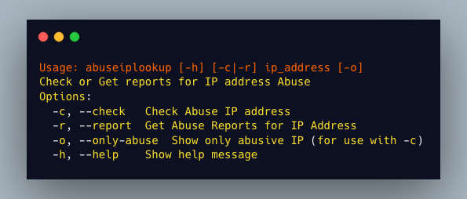

# abuseiplookup

**abuseiplookup:** A command-line tool to check or get abuse reports for an IP address using the AbuseIPDB API




## API KEY Export

You can get your API Key here [AbuseIPDB](https://www.abuseipdb.com/account/api)

```sh
export ABUSEIP_KEY=<Your key>

# Or You can write down your key in file and export it by adding if statement in  .bashrc or .zshrc (Depending on the SHELL You are using)

echo "<Your Key>" > ~/.config/ABUSEIP_KEY

if [ -f ~/.config/ABUSEIP_KEY ]; then
  export ABUSEIP_KEY=$(cat ~/.config/ABUSEIP_KEY)
fi

```


## Some use Cases;

> If needed Sample IPs for testing you can download it [here](https://raw.githubusercontent.com/mrrobot1o1/abuseiplookup/main/sample_ips.txt) (I Got them From ABUSEIPDB)

### Abuse ip check 

```sh
┌──(vikas㉿Enciphers)-[~/abuseiplookup]
└─$ abuseiplookup -c 69.10.120.252
{
  "ipAddress": "69.10.120.252",
  "abuseConfidenceScore": 0,
  "domain": "cablemo.com",
  "hostnames": [
    "ip-69-10-120-252.midstate.ip.cablemo.net"
  ],
  "countryCode": "US",
  "usageType": "Fixed Line ISP"
}
```

### Get Only if abuseConfidenceScore is 100%

```sh
┌──(vikas㉿Enciphers)-[~/abuseiplookup]
└─$ abuseiplookup -c 107.170.246.25 -o
{
  "ipAddress": "107.170.246.25",
  "abuseConfidenceScore": 100,
  "domain": "digitalocean.com",
  "hostnames": [
    "zg-1220f-186.stretchoid.com"
  ],
  "countryCode": "US",
  "usageType": "Data Center/Web Hosting/Transit"
}
```

### Check Report for IP

```sh
abuseiplookup -r 107.170.246.25
```
> Report was very long so i did't attached here it depends on abuse
> score.

### Dealing with multiple IP you can use just a simple for loop. 

```sh

┌──(vikas㉿Enciphers)-[~/abuseiplookup]
└─$ for x in $(cat ip.txt); do abuseiplookup -c $x; done
{
  "ipAddress": "25.199.50.211",
  "abuseConfidenceScore": 0,
  "domain": "mod.uk",
  "hostnames": [],
  "countryCode": "GB",
  "usageType": "Military"
}
{
  "ipAddress": "107.170.246.25",
  "abuseConfidenceScore": 100,
  "domain": "digitalocean.com",
  "hostnames": [
    "zg-1220f-186.stretchoid.com"
  ],
  "countryCode": "US",
  "usageType": "Data Center/Web Hosting/Transit"
}
{
  "ipAddress": "69.10.120.252",
  "abuseConfidenceScore": 0,
  "domain": "cablemo.com",
  "hostnames": [
    "ip-69-10-120-252.midstate.ip.cablemo.net"
  ],
  "countryCode": "US",
  "usageType": "Fixed Line ISP"
}
{
  "ipAddress": "49.27.199.247",
  "abuseConfidenceScore": 0,
  "domain": "kt.com",
  "hostnames": [],
  "countryCode": "KR",
  "usageType": null
}
```


### It can also be usefull while dealing with multiple IP and need only abused IPs. 

```sh
┌──(vikas㉿Enciphers)-[~/abuseiplookup]
└─$ for x in $(cat ip.txt); do abuseiplookup -c $x -o; done
{
  "ipAddress": "107.170.246.25",
  "abuseConfidenceScore": 100,
  "domain": "digitalocean.com",
  "hostnames": [
    "zg-1220f-186.stretchoid.com"
  ],
  "countryCode": "US",
  "usageType": "Data Center/Web Hosting/Transit"
}
{
  "ipAddress": "217.76.62.0",
  "abuseConfidenceScore": 100,
  "domain": "terratransit.de",
  "hostnames": [
    "vmi1127028.contaboserver.net"
  ],
  "countryCode": "DE",
  "usageType": "Data Center/Web Hosting/Transit"
}
{
  "ipAddress": "146.190.22.19",
  "abuseConfidenceScore": 100,
  "domain": "digitalocean.com",
  "hostnames": [],
  "countryCode": "NL",
  "usageType": "Data Center/Web Hosting/Transit"
}
{
  "ipAddress": "150.165.78.1",
  "abuseConfidenceScore": 100,
  "domain": "rnp.br",
  "hostnames": [
    "formigao.dme.ufcg.edu.br"
  ],
  "countryCode": "BR",
  "usageType": "University/College/School"
}
```
